# Google Analytics Customer Revenue Analysis & Prediction
A small percentage of customers produce most of the revenue in many businesses. It is known as the 80/20 rule in marketing. It simply means that 80% of business comes from about 20% of customers. Marketing teams are challenged to make appropriate investments in their promotional strategies. Here, Google Merchandise customer dataset is analysed to visualize the trends in customer revenue and to predict revenue per customer. The outcome will be more actionable operational changes and better use of marketing budgets for those companies who choose to use data analysis on top of Google Analytics data. 

The revenue distribution shows that only a small percentage of customers contribute to the revenue and in this case it is only 1.4%.
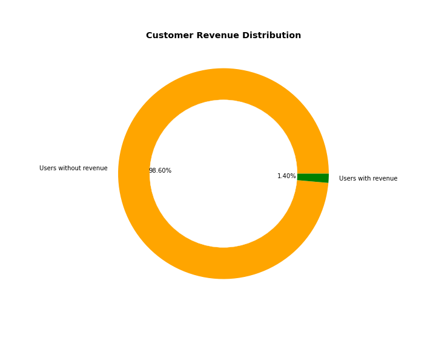
## Analysis based on Country

Total number of visits and total revenue is the highest for United States, but this does not mean that the total revenue is proportional to the number of visits. We can see that the total revenue is less for some countries with more visits. For example Canada has more revenue than India although the number of visits are almost double for India.
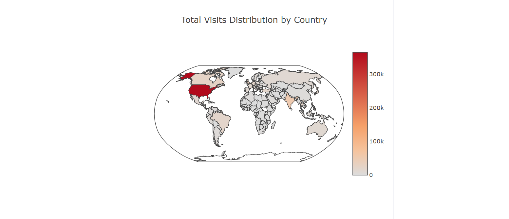
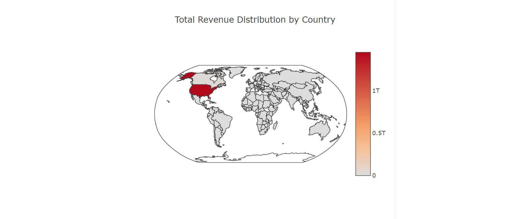

## Analysis based on Device used

96% of customers use desktop and 73.5% of total revenue is from desktop devices. 23% of customers use mobile devices, but they contribute only 3.23% of total revenue. Most revenue comes from Macintosh users and Chrome browser.
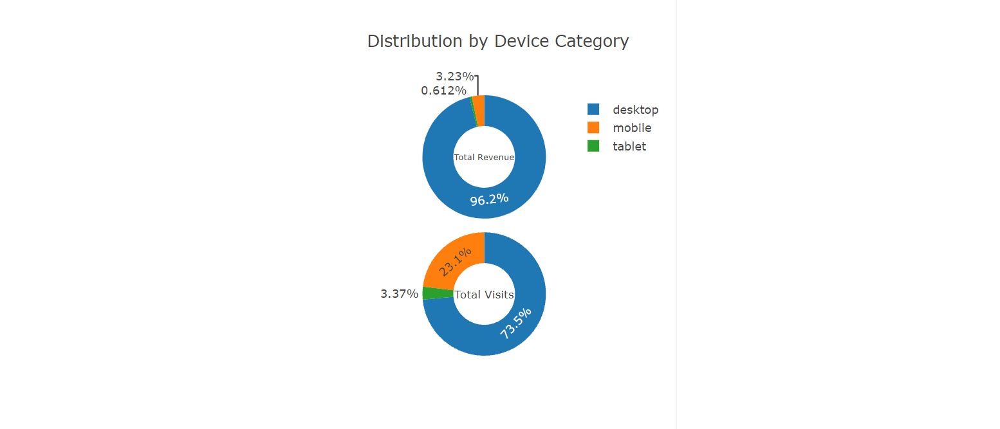
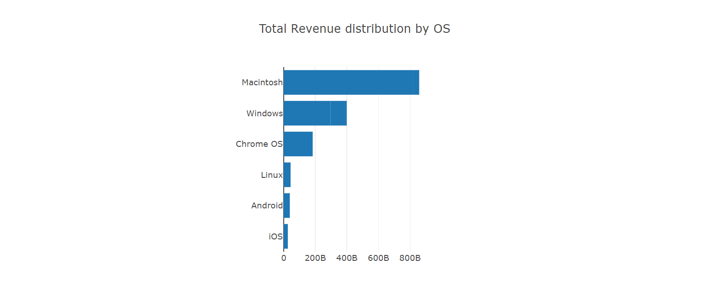
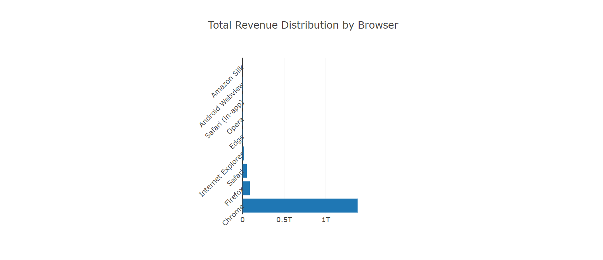
## Analysis based on Traffic Source parameters and Channel

Most of the revenue comes through the medium referral although the number of visits are high with organic medium. The top revenue is obtained with Google as traffic source. The highest number of visits comes with campaign Data Share Promo but it contributes to very low revenue. AW - Dynamic Search Ads Whole Site is the campaign with highest revenue. total revenue among the campaigns. The dropdown gives the option to select different traffic source parameters and the chart will be updated with the selected parameter.
42% of total visits comes from Organic Search channel, but 42% total revenue comes through Referral channel.
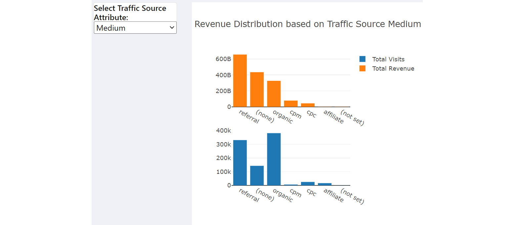
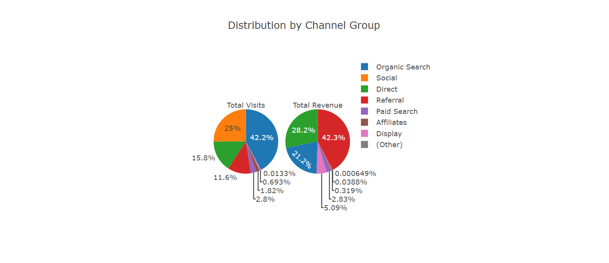
## Distribution by Continent and Time Series Analysis

Highest revenue comes from the continet Americas.
The time series analysis shows that there is no correlation between number of visits and total revenue. Number of visits were increased in November and December of 2016 and also a spike on April 26th of 2017. The highest revenue was recorded on April 5th of 2017.
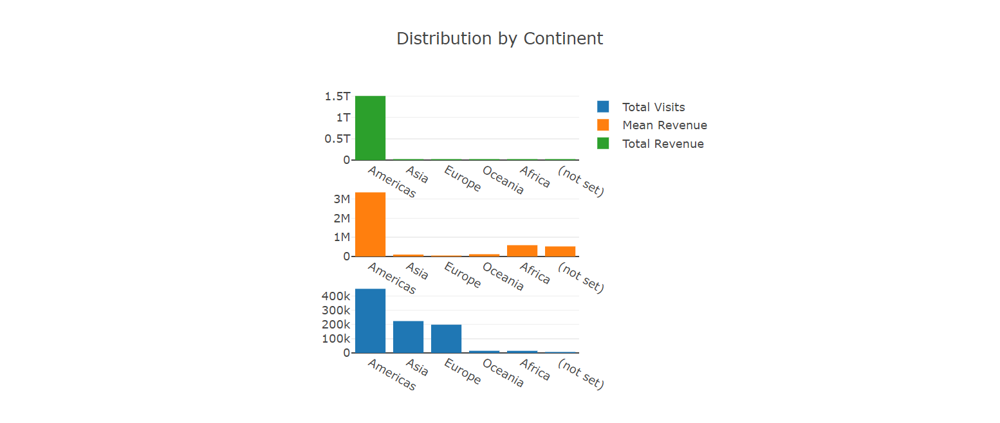
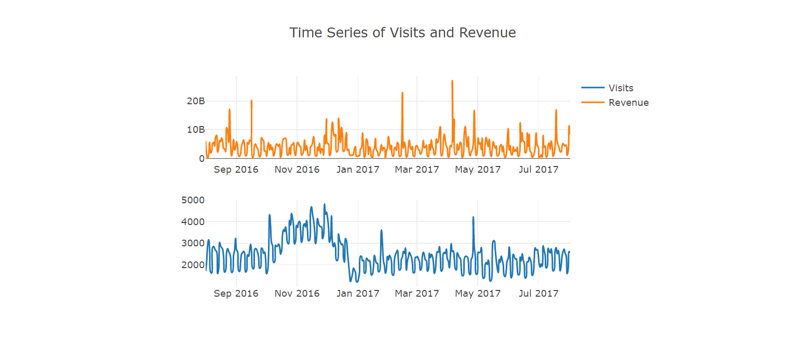
## Data Modelling and Prediction

The data model needs to predict the revenue per customer. This is a hihgly imbalanced dataset with only 1.4% of users contributing to the revenue. The natual logarithm of revenue is used to normalise the revenue Distribution. LGBM Regressor(Light Gradient Booseted Machine) model is used to predict the revenue per customer. The RMSE score of the model is 1.10423.
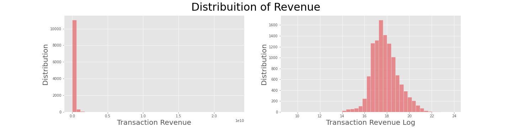
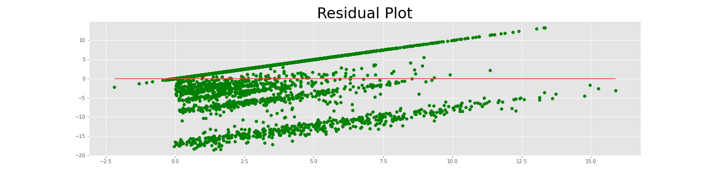

## Steps in the EDA and Prediction process
Data was downloaded from https://www.kaggle.com/c/ga-customer-revenue-prediction/data?select=train.csv and added to Data folder.
Data was in the form of csv file and Python Pandas, Jupyter Notebook $ MongoDB was used for the ETL process.
LGBM Regressor model was used to predict the natural logarith of revenue per customer. Natural logarithm of revenue was used for prediction since the dataset was higly imbalanced.
Python Flask was used to create the application. PyMongo package was used to connect from the application to MongoDB.
HTML, CSS, Javascript, Plotly and Choropleth were used to visualise the analysis and prediction.